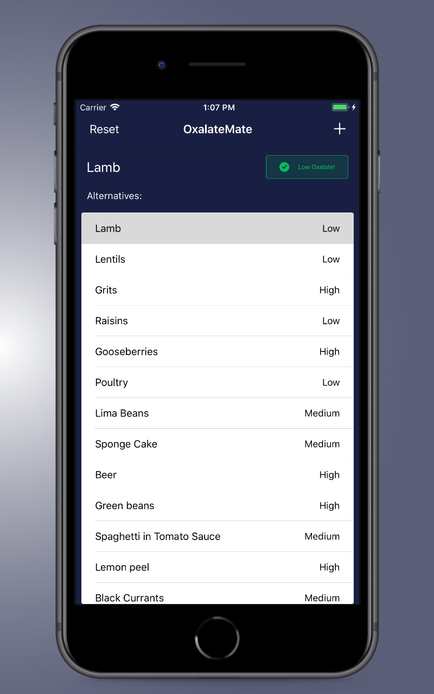
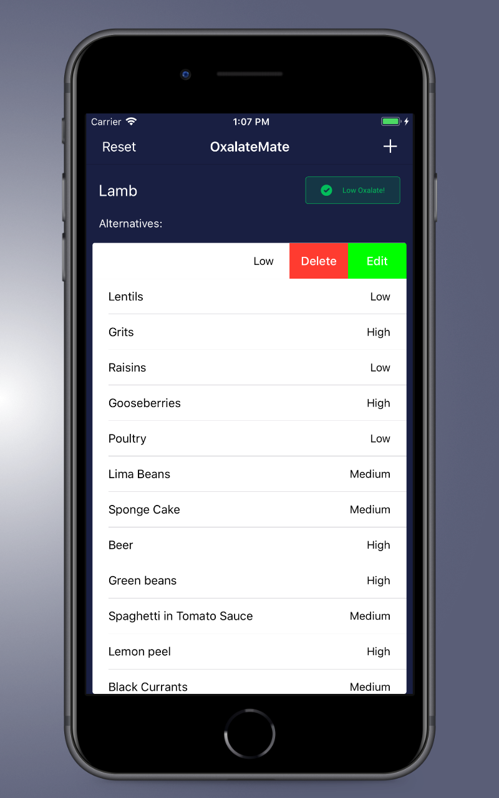
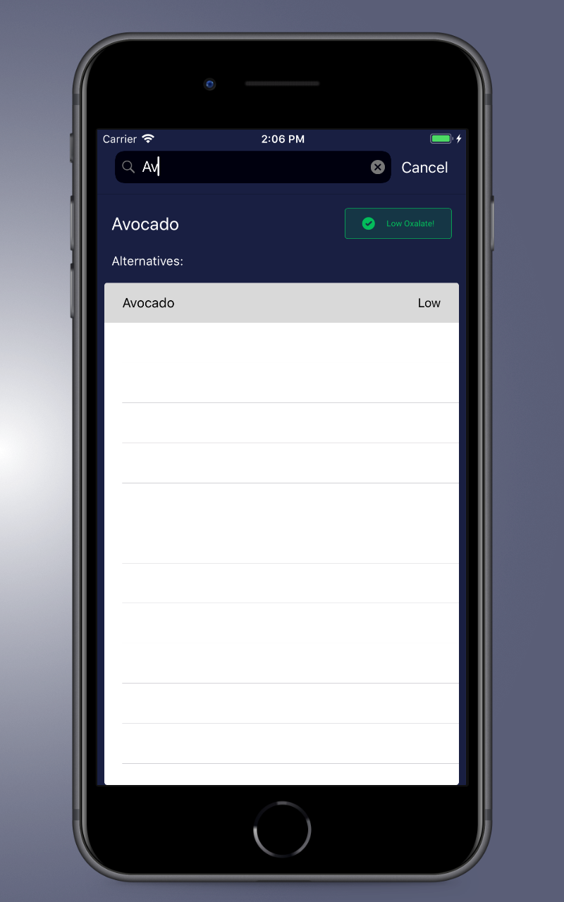
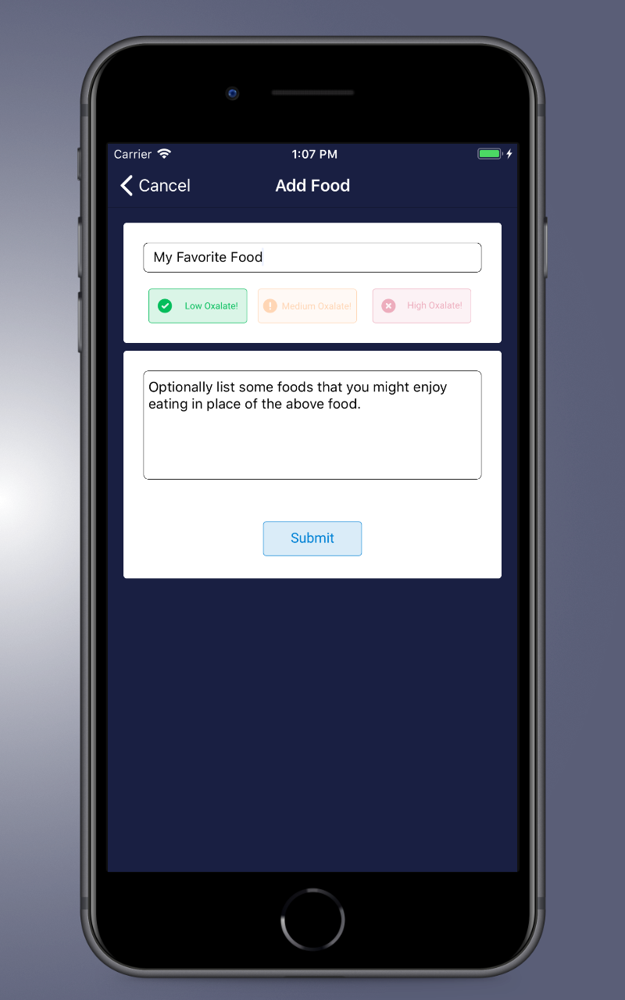

#  Oxalate Mate

## What is OxalateMate?
OxalateMate is a simple, table-view based application created for a family member with a sensitivity to oxalate to quickly check different foods oxalate content.
This is a remake of the original which used Firebase as a back end. This version contains no 3rd party dependencies and does not need a network connection.

## Screenshots

    
    
    
    

## What is Oxalate?
Oxalates are a naturally occurring substance found in a wide variety of foods and play a supportive role in the metabolism of many plants and animals as well as the human body. Oxalates can become problematic however if they over accumulate inside the body and account for about 80% of all kidney stones formed.

It can be difficult to remember which foods do and do not contain oxalate and most products do not include this information on the packaging. In comes OxalateMate, a simple iOS app that lets you store a searchable and customizable list of foods, along with alternative foods that can be substituted for high oxalate foods.

## Getting Started

Since this version of OxalateMate does not contain any 3rd party dependencies, getting the app running could not be simpler. On the initial launch OxalateMate will pre populate the database and it can be reset at any time.

To run OxalateMate on your device
- Clone the repo to your computer
- Change the Bundle Identifier in Xcode.
- Build and run.
